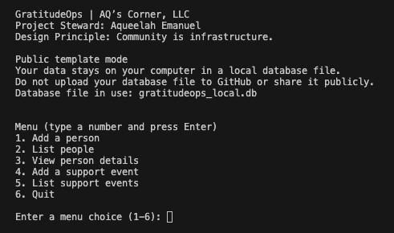
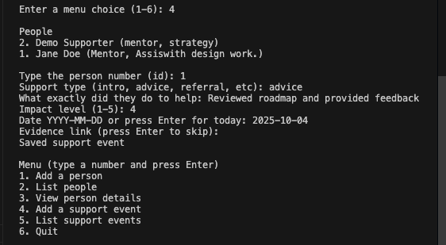

# GratitudeOps

  

A project by AQ’s Corner, LLC  
Project Steward: Aqueelah Emanuel  
Design Principle: Community is infrastructure.

GratitudeOps is a simple local database tool for tracking support, gratitude, and reciprocity. It is designed so you can keep your data private on your own computer.

You can use this as a private database for yourself, or you can publish your own fork as a template. Use it your way.

---

## Screenshots

### Menu

## Quick start

1. Open a terminal in this folder
2. Run this

python3 gratitudeops.py

3. Pick menu options and add people and support events

## Your data stays local

This app creates a local database file on your computer.

Default database file name: gratitudeops_local.db

Do not upload database files to GitHub. The repo includes a .gitignore to help prevent accidental commits.

## Optional: choose a custom database file name

You can set a custom database file name like this

GRATITUDEOPS_DB=my_private_gratitude.db python3 gratitudeops.py

## Credit

Created by Aqueelah Emanuel through AQ’s Corner, LLC.

If you share or fork this project, keep the attribution.
